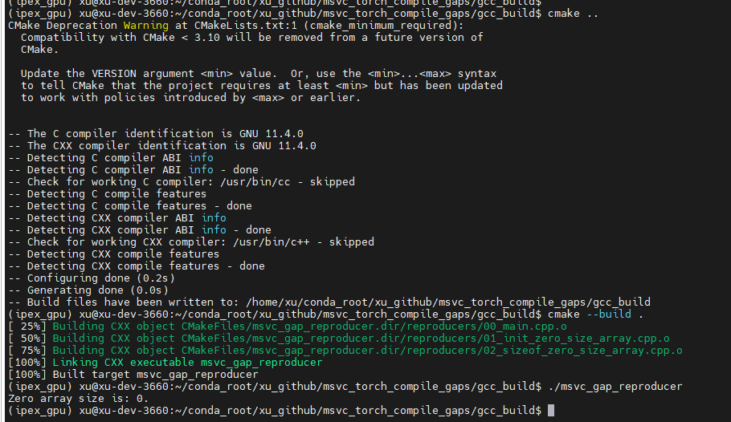

# Background
This project is a small msvc compiler error reproducer to show msvc compiler feature gaps for PyTorch [issue 153180](https://github.com/pytorch/pytorch/issues/153180).

# Principle
As PyTorch [issue 153180](https://github.com/pytorch/pytorch/issues/153180) shows, PyTorch inductor will analysis models and generate some cross platfrom c++ code and runtime build these code to executable binary.

# MSVC compatibility gaps
These cross platfrom c++ code is working well on `gcc`, `clang`, and `intel compiler`, but they may not works well on `msvc`.

I have breakdown the PyTorch [issue 153180](https://github.com/pytorch/pytorch/issues/153180) into this small reproducer and did some tests.

The compatibility gaps are list here:

1. Msvc is not support to `init zero size array`.
2. Msvc is not support to `sizeof zero size array`.

**Tested results:**

1. VS2017 is support `init zero size array`, but not support `sizeof zero size array`.

2. VS2022 is not support `init zero size array` or `sizeof zero size array`.

3. GCC is support both of `init zero size array` and `sizeof zero size array`.

4. `clang` and `intel compiler` are work well as same as gcc. Test screen shot are not shows.

# Conclusion
1. MSVC's compatibility to `zero size array` is a gap to limit PyTorch Windows full support PyTorch inductor.
2. Different version of MSVC are not constant behavior to `zero size array`. For PyTorch project, we current recommended use VS2022.
3. We wish MSFT VS team can make msvc support `zero size array`, and align its behavior to others popular compilers.